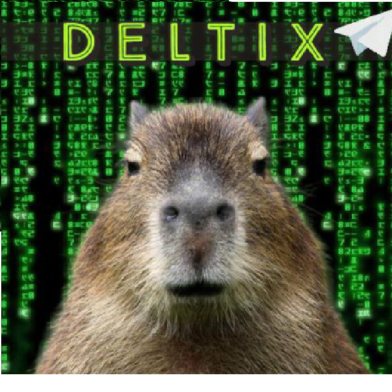
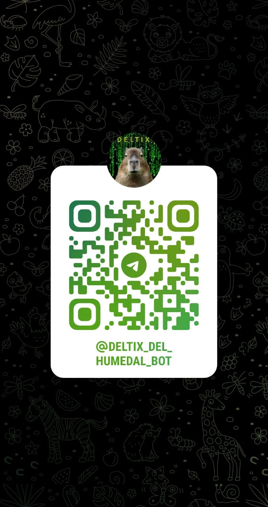

<h1 align="center">
   
  Deltix... el bot del humedal 
  Delta inferior del Paraná - Buenos Aires
</h1>

Soy *Deltix, el bot del humedal!* Mi objetivo es ayudar a quienes habitan y visitan el delta inferior del Paraná. Fui diseñado para proporcionar información y servicios útiles a las personas que habitan o visitan la hermosa región del Delta del Tigre, en Buenos Aires.

*Deltix es un proyecto abierto para colaborar. Contactanos si querés aportar con nuevas ideas y funcionalidades!*

<table>
  <tr>
    <td style="width: 70%;">
      <h2>Características Destacadas</h2>
      <ul>
        <li>🌊 Información de Mareas: Recibí el pronóstico de mareas en tiempo real para la región del Delta del Tigre.</li>
        <li>🔭 Hidrografía Naval: Consultá los datos de mareas de Hidrografía Naval.</li>
        <li>🌦️ Pronóstico Meteorológico: Consultá el pronóstico meteorológico de WindGurú para la zona.</li>
        <li>⛵ Colectivas: Tené siempre a mano los horarios de lanchas colectivas (Jilguero, Interisleña, Líneas Delta).</li>
        <li>🛒 Almaceneras: Conocé los recorridos y contactos de lanchas almaceneras que operan en el Delta.</li>
        <li>🚣 Actividades Isleñas: Descubrí actividades y emprendimientos locales.</li>
        <li>🤣 Memes Islenials: Descubrí los memes más divertidos de la isla.</li>
        <li>🤖 Asistente IA: Podés hacerme preguntas varias y te responderé utilizando inteligencia artificial.</li>
        <li>🔔 Suscripciones: Recibí actualizaciones diarias de mareas, pronósticos y más.</li>
        <li>🤝 Colaborar y Sugerir: Compartí tus sugerencias y colaborá con el bot para mejorarlo.</li>
        <li>📤 Desuscribirte: Si deseas dejar de recibir actualizaciones, podés hacerlo en cualquier momento.</li>
        <li>✉️ Mensajear al Desarrollador: Mandale un mensajito al desarrollador del bot.</li>
      </ul>
    </td>
    <td style="width: 30%; vertical-align: top;">
      
    </td>
  </tr>
</table>

### Podés interactuar con el bot en Telegram buscando a @deltix_del_humedal_bot o haciendo *[click acá](https://t.me/deltix_del_humedal_bot)*
<h1 align="center">

</h1>

## Principales Scripts de la App

### `main2.py`
Bot de telegram (versión 2.0, marzo 2025)

### `app.py`
Aplicación Streamlit (en desuso

### `llm_connector.py`
Conexión con modelo LLM DeepSeek a través del de API de Open Router

### `scraping.py`
Scrapeo de datos de mareas y pronósticos meteorológicos. Utiliza `Selenium` para tomar capturas de pantalla de Windguru, `BeautifulSoup` para datos de Hidrografía Naval y `urllib` para descargar la imagen de mareas del sitio del INA.

### `auto_push.py`
Este script verifica si hay cambios en el repositorio local y, de ser así, los sube automáticamente a GitHub. Es útil para mantener el repositorio actualizado con los últimos datos obtenidos por el script de scraping.

### `pull_data.yml`
GitHub Action para actualizar los archivos scrapeados en el repositorio público. Se ejecuta cada vez que hay un push a la rama `main`.

## Próximamente

Actualmente se está desarrollando un esquema de suscripciones para garantizar la sostenibilidad del bot. 
Los pequeños emprendimientos locales podrán publicar gratuitamente en la agenda isleña, mientras que 
complejos de cabañas, empresas de turismo y lanchas taxis contribuirán con una suscripción mensual. 

Además, se planea implementar las siguientes mejoras:
- Funcionalidad de "Voy y Vuelvo" para compartir viajes en embarcaciones privadas.
- Guía de productos y servicios locales con filtros y categorías.
- CMS en PHP para la autogestión de contenido por parte de los usuarios.

